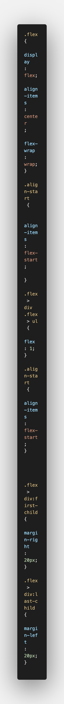

# Frontend Mentor - Fylo landing page with two column layout solution

This is a solution to the [Fylo landing page with two column layout challenge on Frontend Mentor](https://www.frontendmentor.io/challenges/fylo-landing-page-with-two-column-layout-5ca5ef041e82137ec91a50f5). Frontend Mentor challenges help you improve your coding skills by building realistic projects. 

## Table of contents

- [Overview](#overview)
  - [The challenge](#the-challenge)
  - [Screenshot](#screenshot)
  - [Links](#links)
- [My process](#my-process)
  - [Built with](#built-with)
  - [What I learned](#what-i-learned)
  - [Continued development](#continued-development)
  - [Useful resources](#useful-resources)
- [Author](#author)


**Note: Delete this note and update the table of contents based on what sections you keep.**

## Overview

### The challenge

Users should be able to:

- View the optimal layout for the site depending on their device's screen size
- See hover states for all interactive elements on the page

### Screenshot




### Links

- Solution URL: [Add solution URL here](https://your-solution-url.com)
- Live Site URL: [Add live site URL here](https://your-live-site-url.com)

## My process

### Built with

- Semantic HTML5 markup
- CSS custom properties
- Flexbox
- VS Code


### What I learned

I liked how I set up my html elements. This allowed my content to look more organized. For my css I learned how to really apply an image with a style where there needed to be a shape developed outside of the image. It was tough but I got it figured out!  


```html
<section class="light-blue">
    <div class="container">
    <div class-="flex">
    <div>
    <h2>Stay productive, wherever you are</h2>
```
```css
.light-blue::before{
    content:'';
    background-image:url(./images/bg-curve-desktop.svg) ;
    background-size: cover;
    background-position: center center;
    position:absolute;
    top:-60px;
    left: 0;
    height: 60px;
    width:100%;
}
```


If you want more help with writing markdown, we'd recommend checking out [The Markdown Guide](https://www.markdownguide.org/) to learn more.


### Continued development

In my opinion the areas that I would like to focus on is perfecting my css. I feel I do well but there are a few things that I would like to work on more. Such as perfecting details of a page and getting my images or sections to be exactly how i need it to be.


### Useful resources

- [W3 schools](https://www.w3schools.com/ - This helped me when it came down to the social links. I found this to be a great resource and I will continue to us this moving forward.

- [Youtube](https://www.youtube.com/) - whenever I found myself having issues with getting an element to look like I wanted it to look I would look up the issue I was facing on youtube and I would learn how to do it and apply it to my styles. 


## Author

- Website - [Breia John](bmjwebdev.com)
- Frontend Mentor - [@BreiaJohn](https://www.frontendmentor.io/profile/BreiaJohn)
- Twitter - [@breia_john](https://twitter.com/Breia_John)


